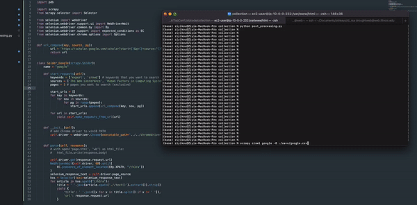

# AITopConfList
The current `list.csv` contains papers from

- CVPR 2018-2021
- ECCV 2018, 2020
- AAAI 2018-2021
- ACL 2018-2021
- CIKM 2018-2021
- ICML 2018-2021
- KDD 2018-2021
- WWW 2018-2021 
- CSCW 2018-2020
- GROUP 2018
- ICCV 2019, 2021
- ICLR 2018-2021

### Auto Crawl Paper Titles from Google Scholar with Specific Keywords and Sources



I developed a new tool to crawl revelant papers from Google Scholar given keywords and paper sources of interests.

For example, if you want to get papers from WWW and CHI conferences that contain "expert" or "crowd" as keywords and you want the results from first 5 pages, the code in `./code/collection/google.py` shoud be below.

```python
keywords = ['expert', 'crowd']
sources = ['The Web Conference', 'Human Factors in Computing Systems']
pages = 5
```

Then run the following =commands to crawl all relevant papers just like you manually search via your browser.

```shell
cd code/collection
scrapy crawl google -O ./save/google.csv
python post_processing.py
```

The generate csv file is `./code/collection/save/google2.csv` with paper title, keyword and source in each row.

**Note:** If you encounter the google varification question, please manually varify for the first time. Then the following crawling does not require human varification anymore.

**Note2:** Please ensure the chromedriver is update-to-date.
